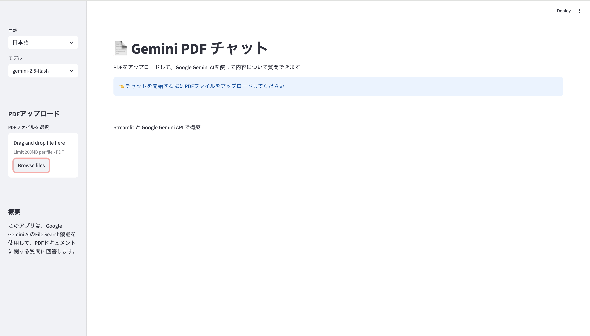

# PDF Chat with Gemini - 技術ドキュメント

## プロジェクト概要

Google Gemini AIのFile Search APIを使用したPDFチャットアプリケーション。Streamlitで構築された対話型インターフェースで、PDFの内容について質問できます。



## 技術スタック

- Python 3.8以上
- streamlit: Webアプリケーションフレームワーク
- google-generativeai: Google Gemini AI SDK
- PyPDF2: PDFテキスト抽出
- python-dotenv: 環境変数管理

## セットアップ

### 依存パッケージのインストール

```bash
uv pip install -r requirements.txt
```

### APIキーの準備

このアプリケーションは**ユーザーが自分のAPIキーを入力する方式**です。

1. [Google AI Studio](https://makersuite.google.com/app/apikey) でAPIキーを取得
2. アプリ起動後、サイドバーにAPIキーを入力

### アプリケーションの起動

```bash
uv run streamlit run src/app.py
```

デフォルトで `http://localhost:8501` で起動。

## セキュリティに関する注意

### APIキーの取り扱い

このアプリケーションは、各ユーザーが自分のGemini APIキーを入力して使用する設計です。

**セキュリティ上の利点:**
- アプリ提供者がAPIコストを負担しない
- 各ユーザーが自分のAPIキー使用量を管理
- APIキーはブラウザセッション内のみで保持（リロードで消去）
- Streamlitはサーバーサイド実行のため、ブラウザのDevToolsからキーは見えない

**注意事項:**
- ⚠️ APIキーを他人と共有しないでください
- ⚠️ 公開されたStreamlit Cloudアプリを使用する場合、信頼できる提供者のみを利用してください
- ⚠️ セッションログにAPIキーが記録される可能性があります
- ⚠️ 本番環境での使用は自己責任で行ってください

**推奨される使い方:**
- ローカル環境での実行が最も安全
- 公開する場合は、利用者に注意事項を明示
- 重要なプロジェクトでは、バックエンドサーバーでAPIキーを管理する実装を検討

## アーキテクチャ

### データフロー

**PDFアップロード時**:
```
User Upload → save_uploaded_file() → create_file_search_store()
→ upload_file_to_store() → wait_operation() → Session State Update
```

**質問処理時**:
```
User Input → query_file_search() → Gemini API (File Search)
→ Response Generation → Display + Save to Chat History
```

**言語切り替え時**:
```
Language Selection → Update Session State → st.rerun() → UI Refresh
```

## 主要機能の実装

### 多言語対応

辞書ベースの翻訳システム：

```python
TRANSLATIONS = {
    'en': {...},
    'ja': {...}
}

def get_text(key, lang='en'):
    return TRANSLATIONS.get(lang, TRANSLATIONS['en']).get(key, key)
```

すべてのUIテキストを一元管理し、`st.session_state.language`で言語設定を保持。

### モデル選択

サイドバーでGemini AIモデルを選択可能：
- gemini-2.5-flash (デフォルト)
- gemini-2.5-pro

`st.session_state.model`に保存され、`query_file_search()`で使用。

### File Search Store管理

ライフサイクル：
1. PDFアップロード時にストア作成
2. ファイルをストアにアップロード
3. チャット中はストアを維持
4. PDFクリア時または終了時にストア削除 (`force=True`)

### セッション管理

```python
st.session_state = {
    'store_name': None,        # File Search Store名
    'chat_history': [],        # チャット履歴
    'pdf_uploaded': False,     # PDF状態
    'pdf_name': None,          # PDFファイル名
    'language': 'en',          # 選択言語
    'model': 'gemini-2.5-flash' # 選択モデル
}
```

### PDFテキスト抽出

PyPDF2を使用：

```python
def extract_text_from_pdf(pdf_file, lang='en'):
    pdf_reader = PdfReader(pdf_file)
    text = ""
    for page in pdf_reader.pages:
        text += page.extract_text() + "\n"
    return text
```

### 非同期処理の待機

```python
def wait_operation(client, op, sleep_sec=2, max_wait_sec=300):
    start = time.time()
    while not op.done:
        if time.time() - start > max_wait_sec:
            raise TimeoutError("Operation timed out.")
        time.sleep(sleep_sec)
        op = client.operations.get(op)
    return op
```

タイムアウト機能付き（デフォルト5分）。

## Gemini API統合

### File Search API

**ストア作成**:
```python
store = client.file_search_stores.create(
    config={'display_name': store_name}
)
```

**ファイルアップロード**:
```python
upload_op = client.file_search_stores.upload_to_file_search_store(
    file=file_path,
    file_search_store_name=store.name,
    config={
        'display_name': display_name,
        'custom_metadata': [...]
    }
)
```

**クエリ実行**:
```python
response = client.models.generate_content(
    model=selected_model,
    contents=question,
    config=types.GenerateContentConfig(
        tools=[
            types.Tool(
                file_search=types.FileSearch(
                    file_search_store_names=[store_name]
                )
            )
        ]
    )
)
```

## エラーハンドリング

実装されているエラー処理：
- API Key未設定: アプリ起動時にチェック
- PDF抽出エラー: try-exceptでキャッチ
- ファイル保存エラー: 一時ファイル作成失敗時の処理
- ストア操作エラー: 各API呼び出しでエラーハンドリング
- タイムアウト: Operations API待機時のタイムアウト処理

すべてのエラーメッセージは`get_text()`を通じて多言語対応。

## ファイル構造

```
file_search_tool_api/
├── src/
│   ├── app.py              # メインアプリケーション
│   ├── requirements.txt    # 依存パッケージ
│   └── .env               # 環境変数
├── docs/
│   └── file_search_api_guide.md  # API実装ガイド
├── Note_docs.md           # ユーザー向けガイド
├── README.md              # 技術ドキュメント
└── CLAUDE.md              # Claude Code向けガイド
```

## 開発コマンド

```bash
# デバッグモードで起動
streamlit run src/app.py --logger.level=debug

# 特定のポートで起動
streamlit run src/app.py --server.port=8502

# ブラウザを自動で開かない
streamlit run src/app.py --server.headless=true
```
